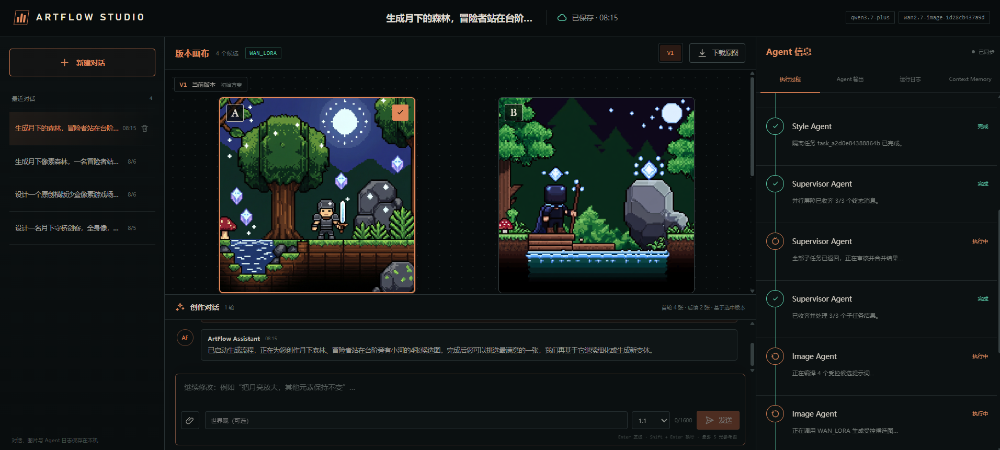
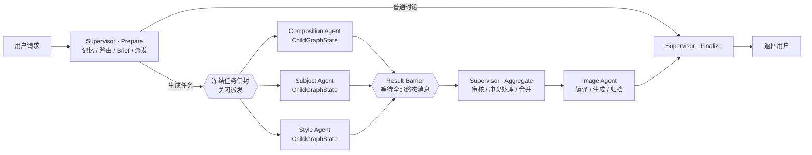
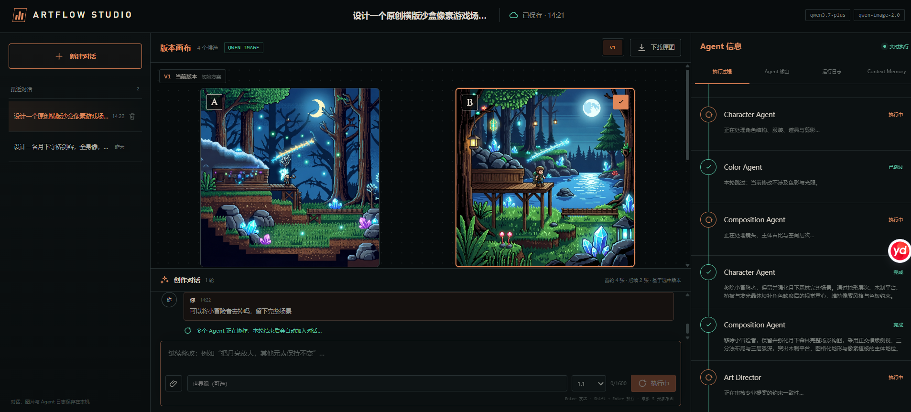
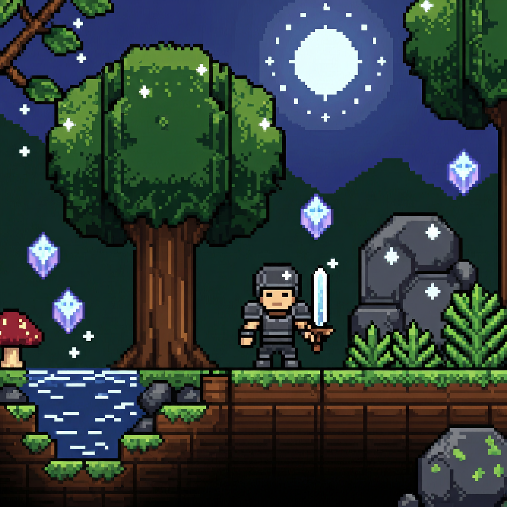
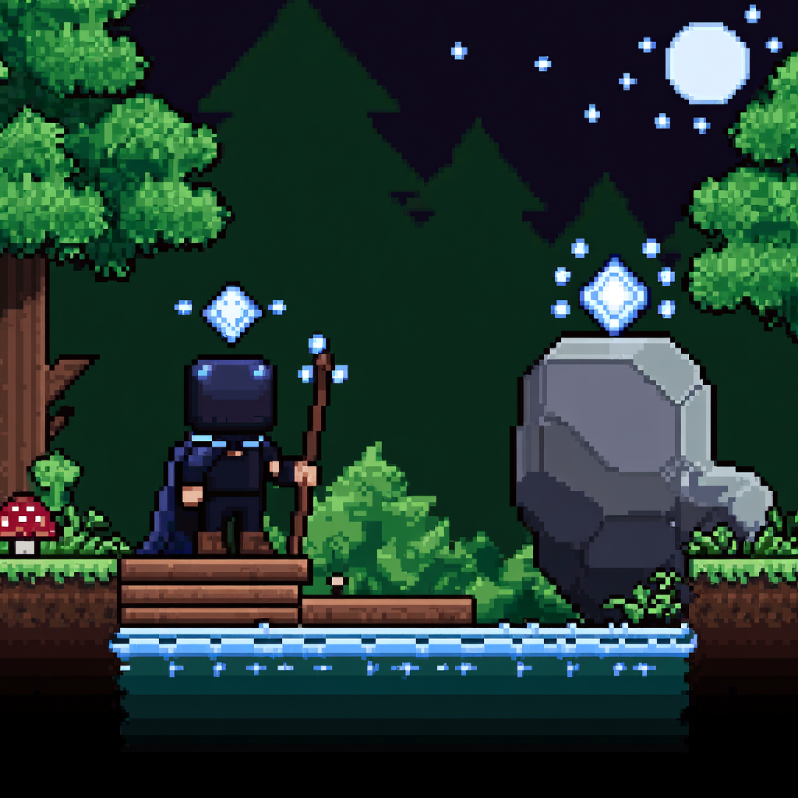
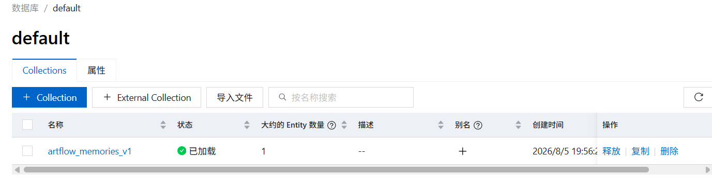

# ArtFlow Studio

轻量、桌面端优先的多 Agent 游戏美术对话生成平台。项目重点放在后端 Agent 编排、父子上下文隔离、连续图像修改、长期记忆和可追踪日志，不包含移动端、团队权限或复杂资产管理。



## 项目能力

- **真实 5-Agent 链路**：Supervisor 一次性派发任务，Composition、Subject、Style 在私有子图中并行执行，Image Agent 负责提示词编译、模型调用和结果归档。
- **对话式持续修改**：支持多对话、本地保存、会话删除、首轮 4 张候选和后续基于选中父图生成 2 张变体。
- **多图像后端**：支持 Mock、Qwen Image、Wan LoRA 和可选 ComfyUI，当前真实链路已接入阿里云千问文本模型与部署后的 Wan LoRA 图像模型。
- **五层上下文管理**：大结果落盘、Snip、Micro-compact、Context Collapse 和 Auto-compact，并包含连续失败 3 次熔断。
- **长期记忆**：使用 `CLAUDE.md` 保存项目约束，SQLite 保存会话；可选 Milvus + Qwen Embedding 做语义检索。
- **完整运行日志**：记录 Agent、任务 ID、模型、结构化输出、耗时、Token、重试、错误和上下文摘要。

## 5-Agent 架构

| Agent | 类型 | 主要职责 |
|---|---|---|
| Supervisor Agent | 父 Agent | 读取项目记忆，完成路由、Brief、任务派发、结果审核、冲突处理和最终回复 |
| Composition Agent | 隔离子 Agent | 镜头、构图、主体占比和空间层次 |
| Subject Agent | 隔离子 Agent | 角色、道具、姿态、轮廓、身份连续性和对象删除 |
| Style Agent | 隔离子 Agent | 画风、色板、光照、材质和明暗分离 |
| Image Agent | 执行 Agent | Prompt 编译、图像 Provider 调用、下载和结果归档 |



### 父子上下文隔离

父图持有完整 `ArtDesignState`，每个子图只持有自己的 `ChildGraphState`：

```text
ChildGraphState
├── task: ChildTaskEnvelope
├── result: ChildResultEnvelope
└── events
```

- `ChildTaskEnvelope` 使用 Pydantic `frozen=True`，派发后不可修改。
- 子 Agent 只能读取职责白名单中的字段，不读取完整会话、其他子 Agent 提案或父级隐藏状态。
- 上下文序列化后保存 SHA-256 摘要，每次读取重新反序列化，不共享父状态中的可变引用。
- Supervisor 在 Prepare 阶段设置 `dispatch_closed=true`；子 Agent 运行期间不存在父级插话或追加任务的通道。
- 三个子图通过 `asyncio.gather(..., return_exceptions=True)` 并发执行；成功、失败和超时都会形成终态信封。
- Supervisor 只有在 Result Barrier 收齐全部任务 ID 后才会恢复并执行合并。

## Wan LoRA 风格测试

### 微调前：Prompt 强约束 + 风格参考图

微调前主要依赖正负 Prompt、硬风格契约和参考图约束。该方案能够生成满足主题的像素场景，但不同批次间的像素密度、色板、材质细节和轮廓语言仍可能漂移。



### 微调后：Wan LoRA

在许可证允许的范围内，基于开源像素游戏素材构建训练数据，并通过 SFT-LoRA 学习统一的像素簇、有限色板、图格地形和角色比例。当前项目已经完成部署模型调用、异步任务轮询、候选图下载和本地归档。

<table>
  <tr>
    <td width="50%"></td>
    <td width="50%"></td>
  </tr>
  <tr>
    <td align="center">角色与横版地形样例</td>
    <td align="center">角色、河流与巨石样例</td>
  </tr>
</table>

### 当前观察

- 端到端功能正常：文本 Agent、5-Agent 编排、Wan LoRA 调用、候选图返回和本地归档均已跑通。
- 微调后样例在硬边像素簇、色板范围、地形模块化和角色尺寸方面表现得更加统一。
- 同一主题下的月光、森林、晶体和横版地形语言具有较明显的连续性。

### 当前不足

- 训练集中的月亮、晶体、森林、蘑菇和巨石等高频元素有重复出现倾向，存在一定过拟合风险。
- 场景类型和角色种类仍然有限，需要补充室内、城镇、地下区域、道具和不同体型角色数据。
- 部分结果存在构图留黑、边缘裁切和主体尺度波动，仍需优化训练集裁剪策略与验证集覆盖。
- 当前展示属于少量样例的**功能验收与定性观察**，不是统计意义上的 Benchmark；风格一致性提升率和人工偏好胜率需要在固定测试集上盲评后再填写。

> 仓库不包含训练数据、商业素材、模型权重或 API Key。使用开源游戏截图训练前，应确认素材许可证允许相应的训练、再分发和商业用途。

## Milvus 语义记忆验证

项目支持使用 Milvus 保存压缩后的语义记忆向量，原始对话仍由 SQLite 保存，大结果由本地 Blob Store 或可选 OSS 保存。下图为远程 Milvus 实例中的 `artflow_memories_v1` Collection，已成功创建、加载并写入测试 Entity。



Milvus 是可选组件。停止远程节点后，将 `ARTFLOW_VECTOR_BACKEND` 改回 `local`，项目仍可使用本地 SQLite 记忆运行。

## 快速启动

### 方式一：启动脚本

```powershell
git clone https://github.com/gengqihao499-cell/art_studio.git
Set-Location art_studio

# 首次运行：创建 backend/.venv、安装依赖并生成 backend/.env
.\Setup-ArtFlow.cmd

# 启动后端并打开 http://127.0.0.1:8000
.\Start-ArtFlow.cmd
```

### 方式二：从源码启动后端

```powershell
Set-Location backend

python -m venv .venv
.\.venv\Scripts\python.exe -m pip install -r requirements.txt
.\.venv\Scripts\python.exe -m uvicorn app.main:app --host 127.0.0.1 --port 8000
```

### 开发前端

```powershell
Set-Location frontend
npm install
npm run dev
```

前端开发服务器启动后，按终端显示的地址访问；生产模式由 FastAPI 提供 `frontend/dist` 中的静态文件。

## 启用千问与 Wan LoRA

只在本地 `backend/.env` 中填写密钥，禁止提交到版本库：

```dotenv
ARTFLOW_AGENT_BACKEND=qwen
ARTFLOW_IMAGE_BACKEND=wan_lora

DASHSCOPE_API_KEY=你的API_Key
DASHSCOPE_WORKSPACE_ID=你的Workspace_ID
DASHSCOPE_REGION=cn-beijing
QWEN_CHAT_MODEL=qwen3.7-plus

# 填写部署接口返回的 deployed_model，不是训练 job_id
WAN_DEPLOYED_MODEL=你的_deployed_model
WAN_LORA_TRIGGER_WORD=你的训练触发词
WAN_API_HOST=https://dashscope.aliyuncs.com
```

保存后重新启动 `Start-ArtFlow.cmd`。健康检查地址：

```text
http://127.0.0.1:8000/api/health
```

## 代码入口

| 文件 | 功能 |
|---|---|
| `backend/app/graph/art_design_graph.py` | 5-Agent LangGraph 主图 |
| `backend/app/agents/supervisor_agent.py` | Supervisor 的 Prepare、Aggregate、Finalize 阶段 |
| `backend/app/agents/parallel_specialists.py` | 私有子图、子 Agent 并行执行和结果屏障 |
| `backend/app/agents/image_agent.py` | Prompt 编译与图像生成 |
| `backend/app/schemas/agent_protocol.py` | 不可变父子任务和结果协议 |
| `backend/app/context/` | `CLAUDE.md`、五层压缩、向量检索和熔断 |
| `backend/app/image_backends/wan_lora_backend.py` | Wan LoRA 异步调用、轮询、下载和归档 |
| `backend/tests/test_multi_agent_architecture.py` | 上下文隔离、并行、超时和单向通信测试 |

## 改进和未来目标
LoRA微调效果并不好，原因之一在数据收集上，基本来自游戏截图，该游戏的场景大多由程序生成，所谓风格背景其实很少，导致背景生成时基本由wan模型基础知识构建。

### 目标：
1、构建更加统一画风的数据集，可能来自同一个开源画师或者别的网站，需要花费更多经历在数据清洗上。

2、LoRA评估这块，用的是AI写的确定性算法，但是太片面，比较完善点的评测应该有确定性图像算法+视觉大模型裁判+多人匿名A/B盲评，后续有时间完成这部分。

3、积累人工偏好数据集之后，后期应该加入DPO，这样可能效果会更好。

